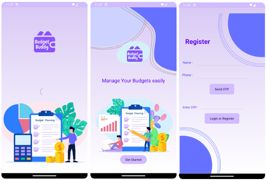
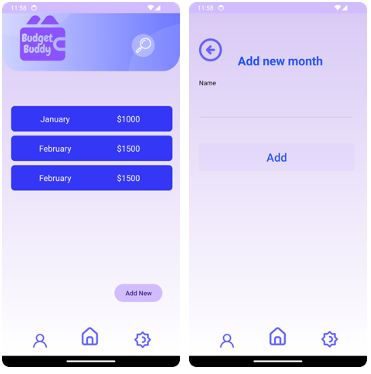
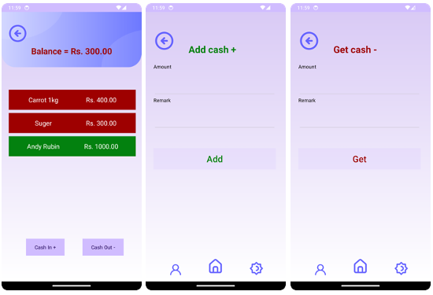

# Budget Buddy

## Overview
**Budget Buddy** is a mobile application designed to help boarding students manage their monthly budget and track their expenses. With the increasing cost of living and limited financial resources available to students, Budget Buddy provides a user-friendly platform for tracking expenses and generating insightful reports to aid in financial planning.

## Features
- **Expense Tracking:** Users can enter their expenses with amount and remarks, allowing them to track their spending in various categories such as food, rent, utilities, and other bills.
- **Income Management:** Users can enter their monthly income (cash in) to keep a clear view of their available funds.
- **Collaborative Budgeting:** Users can add other users by phone number, making it easier for students sharing housing to collaborate on budgeting and spending tracking.
- **Secure Authentication:** Users are identified and authenticated using their mobile numbers, ensuring a seamless and secure experience.
- **Insightful Reports:** The app generates reports summarizing the user's spending habits, identifying areas of overspending or underspending, and providing ideas for better financial management. These reports can be customized using various filters, including time duration and entry type.

## Screenshots





## Technologies Used
- **Android Studio**: Development environment
- **XML**: UI Design
- **Java**: Backend logic

## Installation
1. Clone the repository:
    ```bash
    git clone https://github.com/yourusername/budget-buddy.git
    ```
2. Open the project in Android Studio.
3. Build and run the project on an emulator or physical device.

## Usage
1. Register using your mobile number.
2. Enter your monthly income and categorize your expenses.
3. Add other users to collaborate on budgeting.
4. Generate and review reports to manage your finances effectively.

## Contributions
Contributions are welcome! Please fork the repository and submit a pull request with your improvements.


---

**Budget Buddy** - Your personal finance companion for smart budgeting and expense tracking.
